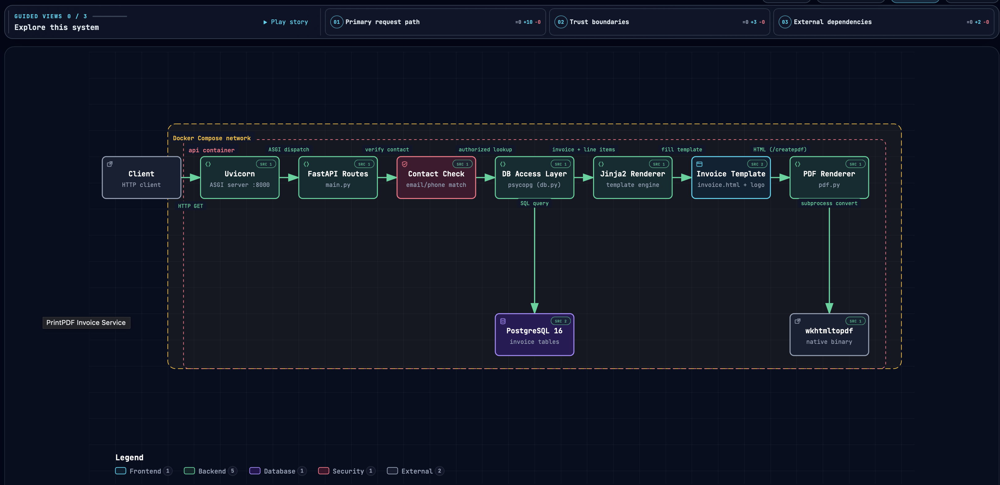

# 📄 Business Document Generation API

A FastAPI microservice that retrieves structured business data from PostgreSQL, renders an HTML document using Jinja2 and generates a PDF suitable for delivery or download.

The project demonstrates a reusable pattern for applications that need to transform database records into customer-facing documents such as:

- invoices
- statements
- receipts
- confirmations
- reports
- business forms

## 🎯 Problem

Many business applications need to generate consistent documents from structured data.

Rather than embedding document generation directly into a larger application, this project isolates that responsibility behind a small HTTP service.

## 🏗️ Architecture

The service is split into clear layers: a database for structured data, an API layer for business logic and access control, a templating layer that turns data into a document, and a rendering step that produces the final PDF. Each piece can be understood, tested, and replaced on its own.

An interactive, explorable version of this diagram is published [here](https://pacordev.github.io/paco_html_to_pdf/docs/printpdf-architecture.html).

## 🔄 Workflow

Database → FastAPI → Jinja2 → HTML → PDF

The API retrieves invoice data, validates access to the requested invoice, renders the appropriate template and returns either HTML or PDF output.

## 🛠️ Technology

Python · FastAPI · PostgreSQL · Jinja2 · Docker · wkhtmltopdf

## 💡 What this demonstrates

- REST API development
- PostgreSQL integration
- Template-based document generation
- Business-rule validation
- Dockerized services
- Separation of concerns
- Reusable backend architecture

---

Want to dig into the implementation — API endpoints, database schema, or how to run it locally? Check out the [technical manual](docs/technical-manual.md) in case someone wants to read the more technical stuff.